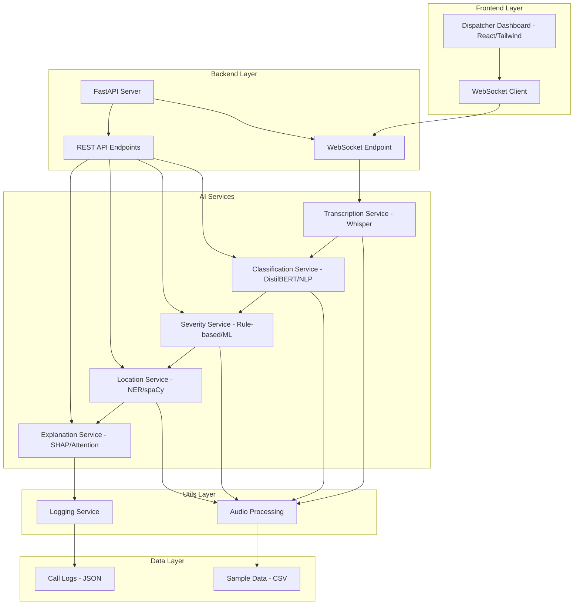

# RAPID-100 Architecture Diagram

## System Components

### Frontend (React + Tailwind)
- Dispatcher dashboard with real-time updates
- Live call panel showing transcription
- Summary panel with structured data
- Routing panel with department suggestions
- Explainability panel with highlighted phrases
- Timeline view showing AI decision process

### Backend (Python + FastAPI)
- RESTful API endpoints for classification and simulation
- WebSocket endpoint for real-time transcription streaming
- Modular service architecture
- Async processing for performance

### AI Services
- **Transcription Service**: Converts speech to text using Whisper
- **Classification Service**: Determines emergency type using NLP
- **Severity Service**: Assigns priority level based on keywords/rules
- **Location Service**: Extracts location information using NER
- **Explanation Service**: Provides reasoning for AI decisions

### Data & Logging
- Structured JSON logging for auditability
- Sample dataset for testing and training
- Performance metrics tracking